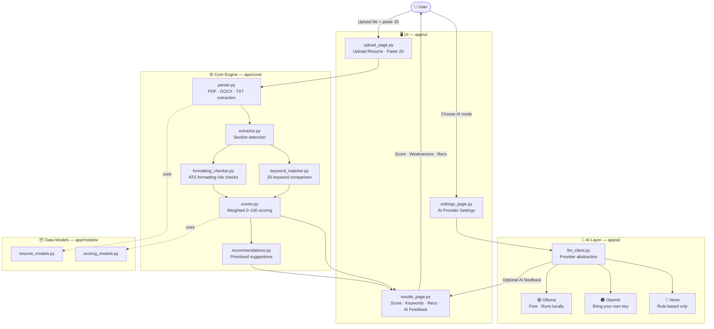

# ATS Insight

> Open-source resume ATS readiness analyzer — free, local, transparent.

ATS Insight helps job seekers understand how their resumes may perform against
Applicant Tracking Systems (ATS) and recruiter screening.  
It runs **100 % locally on your machine** — no account required, no data sent externally.

Built and maintained by [Ray Maldonado](https://www.linkedin.com/in/rmaldonado)

---

## What It Does

Upload a resume (PDF, DOCX, or TXT), optionally paste a job description, and receive:

| Output | Description |
|---|---|
| **Overall ATS Score (0–100)** | Weighted composite across five categories |
| **Resume Structure** | Detects missing sections, contact info gaps |
| **Parsing Safety** | Flags multi-column layouts, symbols, tables |
| **Keyword Relevance** | Matches your resume terms against the JD |
| **Achievement Quality** | Checks for metrics and action verbs |
| **Recruiter Readability** | Location, bullet consistency, line length |
| **Recommendations** | Prioritised, practical improvement list |
| **AI Feedback** | Optional deeper narrative (Ollama or OpenAI) |

---

## Architecture

The diagram below shows how data flows through the app — from the file you upload
to the score and feedback you receive.  
Update this section whenever modules are added or the pipeline changes.



> **Solid arrows** = data / control flow.  
> **Dashed arrows** = module dependency (uses a data model).  
> The AI layer sits outside the required path — the app works fully without it.

---

## AI Modes

ATS Insight ships with **three AI modes** — you choose based on your preference:

| Mode | Cost | How to enable |
|---|---|---|
| **None (default)** | Free | Runs without any setup |
| **Ollama — Local AI** | Free | Install Ollama + pull a model |
| **OpenAI — Your Key** | Pay-per-use | Paste your API key in the Settings tab |

> The default mode is **none** — you get full scoring and recommendations with
> zero configuration.  
> Ollama is the recommended path if you want AI feedback at no cost.

---

## How to Use ATS Insight

You have two options:

| Option | Details |
|---|---|
| **Run locally** | Clone the repo, install dependencies, run with Streamlit — full control, works offline |
| **Run free online** | *(Coming soon)* — No install needed, runs in your browser via a hosted deployment |

> The hosted online version is **TBD** and will be linked here once available.  
> For now, follow the local setup below — it takes about 5 minutes.

---

## Quick Start

### 1 — Prerequisites

- Python 3.11 or newer
- `pip` (comes with Python)
- A terminal (macOS Terminal, iTerm2, VS Code integrated terminal, etc.)

### 2 — Clone or download the project

```bash
git clone https://github.com/rayme11/ATS-Readiness-Checker.git
cd ATS-Readiness-Checker
```

### 3 — Create a virtual environment

```bash
python -m venv .venv
```

### 4 — Activate the virtual environment

**macOS / Linux**
```bash
source .venv/bin/activate
```

**Windows (PowerShell)**
```powershell
.venv\Scripts\Activate.ps1
```

You should see `(.venv)` at the start of your terminal prompt.

### 5 — Install dependencies

```bash
pip install -r requirements.txt
```

### 6 — Copy the environment file

```bash
cp .env.example .env
```

Leave `.env` as-is for the default rule-based mode.  
See [AI Configuration](#ai-configuration) below to enable Ollama or OpenAI.

### 7 — Run the app

```bash
streamlit run app/main.py
```

Streamlit will print a local URL (usually `http://localhost:8501`).  
Open it in your browser — the app is ready to use.

---

## AI Configuration

### Option A — Ollama (Free, Runs Locally)

Ollama lets you run open-source LLMs like Llama 3 on your own hardware.
No API key, no usage cost, no data leaves your machine.

**Step 1 — Install Ollama**

```bash
# macOS (Homebrew)
brew install ollama

# Or download the installer from https://ollama.ai
```

**Step 2 — Start the Ollama server**

```bash
ollama serve
# Leave this terminal open (or run it as a background service)
```

**Step 3 — Pull a model** (one-time download, ~4 GB for llama3)

```bash
ollama pull llama3
```

Other good free models:
```bash
ollama pull mistral       # faster, slightly smaller
ollama pull llama3.2      # newer, more capable
ollama pull gemma2        # Google's open model
```

**Step 4 — Enable Ollama in ATS Insight**

Open the **AI Settings** tab in the app, select **Ollama — Free & Local**,
then click **Test Connection** to confirm it's working.

---

### Option B — OpenAI (Bring Your Own Key)

If you already have an OpenAI API key and prefer GPT-4o quality feedback:

1. Get a key at https://platform.openai.com/api-keys
2. Open the **AI Settings** tab in the app
3. Select **OpenAI — Bring Your Own Key**
4. Paste your key into the password field

**Security note:**  
Your key is stored in Streamlit session memory only.  
It is never written to disk or sent anywhere except directly to OpenAI's API.  
It is cleared when you close or refresh the browser tab.

You can also set it via `.env` for convenience during local development:
```bash
# .env  (never commit this file)
AI_PROVIDER=openai
OPENAI_API_KEY=sk-...
OPENAI_MODEL=gpt-4o-mini
```

---

## Running Tests

```bash
# From the repo root, with .venv activated
pytest tests/ -v
```

Expected output:
```
tests/test_parser.py          - 5 tests
tests/test_scorer.py          - 7 tests
tests/test_keyword_matcher.py - 7 tests
```

---

## Project Structure

```
ATS-Readiness-Checker/          ← repo root (you are here)
├── app/
│   ├── main.py               ← Streamlit entry point  →  streamlit run app/main.py
│   ├── config.py             ← Environment variable loading
│   ├── ui/
│   │   ├── upload_page.py    ← File upload + JD input
│   │   ├── results_page.py   ← Score display + recommendations
│   │   └── settings_page.py  ← AI provider configuration
│   ├── core/
│   │   ├── parser.py         ← PDF / DOCX / TXT extraction
│   │   ├── extractor.py      ← Section detection
│   │   ├── formatting_checker.py  ← ATS formatting risk checks
│   │   ├── keyword_matcher.py     ← JD keyword comparison
│   │   ├── scorer.py              ← Weighted category scoring
│   │   └── recommendations.py    ← Prioritised suggestion builder
│   ├── ai/
│   │   ├── llm_client.py     ← Ollama + OpenAI client abstraction
│   │   ├── prompts.py        ← Prompt templates
│   │   └── ai_feedback.py    ← High-level AI feedback functions
│   └── models/
│       ├── resume_models.py  ← ParsedResume, ResumeContact, etc.
│       └── scoring_models.py ← ScoringResult, CategoryScore, etc.
├── tests/
│   ├── test_parser.py
│   ├── test_scorer.py
│   └── test_keyword_matcher.py
├── sample_data/
│   └── sample_jd.txt         ← Example job description for testing
├── .env.example              ← Copy to .env and fill in
├── .venv/                    ← Virtual environment (gitignored)
├── requirements.txt
├── LICENSE                   ← MIT
└── README.md                 ← This file
```

---

## Scoring Breakdown

| Category | Weight | What is checked |
|---|---|---|
| **Resume Structure** | 20 % | Email, phone, Experience, Education, Skills, Summary sections |
| **Parsing Safety** | 20 % | Symbols, multi-column layout, tables, date consistency |
| **Keyword Relevance** | 30 % | Term overlap between resume and job description |
| **Achievement Quality** | 15 % | Metrics/numbers, action verbs |
| **Recruiter Readability** | 15 % | Location format, bullet consistency, line length |

---

## Honest Limitations

- Resume parsing works best on **single-column, text-based PDFs**.  
  Scanned / image PDFs will return empty or garbled text.
- ATS systems vary widely — this tool simulates common patterns, not every platform.
- Keyword matching is heuristic. It does not replicate any specific recruiter software.
- AI feedback quality depends on the model you choose. Ollama models may be less
  polished than GPT-4o but are completely free.

---

## Build Status

| Phase | Status | Description |
|---|---|---|
| Phase 0 — Setup | ✅ Done | Project structure, virtual env, dependencies |
| Phase 1 — Parsing | ✅ Done | PDF, DOCX, TXT extraction |
| Phase 2 — Section Detection | ✅ Done | Experience, Skills, Education, etc. |
| Phase 3 — Formatting Checks | ✅ Done | Symbols, columns, dates, contact info |
| Phase 4 — Keyword Matching | ✅ Done | Resume vs JD term comparison |
| Phase 5 — Scoring Engine | ✅ Done | Weighted 0-100 category scoring |
| Phase 6 — Recommendations | ✅ Done | Prioritised actionable suggestions |
| Phase 7 — Streamlit UI | ✅ Done | Upload, results, settings pages |
| Phase 8 — AI Integration | ✅ Done | Ollama (free local) + OpenAI (BYOK) |
| Phase 9 — Local AI Expansion | 🔜 Next | Additional Ollama model guidance |
| Phase 10 — GitHub Polish | 🔜 Next | Screenshots, CI, badges |
| Phase 11 — Productisation | 🔜 Future | Save history, comparison, auth |

---

## Contributing & Branching Strategy

This project follows a simple, clean branching model that keeps `main` always stable
while allowing free development on `dev` and short-lived feature branches.

### Branch Map

```
main          ← stable, deployable, protected
  └── dev     ← integration branch — all features land here first
        ├── feature/my-feature     ← new functionality
        ├── fix/my-bug-fix         ← bug corrections
        └── hotfix/critical-patch  ← urgent fixes (merges to main AND dev)
```

### Rules

| Branch | Purpose | Who merges into it |
|---|---|---|
| `main` | Production-ready, always green | PRs from `dev` (or `hotfix/*`) only |
| `dev` | Active development integration | PRs from `feature/*` and `fix/*` |
| `feature/*` | One feature or improvement per branch | Creator, via PR into `dev` |
| `fix/*` | Bug fix not urgent enough for hotfix | Creator, via PR into `dev` |
| `hotfix/*` | Critical fix that can't wait for `dev` | Creator, via PR into `main` AND `dev` |

### Step-by-Step: Starting New Work

**1 — Make sure your local `dev` is up to date**
```bash
git checkout dev
git pull origin dev
```

**2 — Create your feature branch from `dev`**
```bash
git checkout -b feature/your-feature-name
# examples:
#   feature/add-pdf-export
#   fix/keyword-score-edge-case
#   hotfix/crash-on-empty-resume
```

**3 — Do your work, commit often with clear messages**
```bash
git add .
git commit -m "feat: add PDF export button to results page"
# Prefix conventions:
#   feat:     new feature
#   fix:      bug fix
#   docs:     README or comment changes
#   test:     test-only changes
#   refactor: code restructuring without behaviour change
#   chore:    tooling, config, deps
```

**4 — Push your branch and open a Pull Request into `dev`**
```bash
git push origin feature/your-feature-name
# Then open a PR on GitHub: base = dev, compare = your branch
```

**5 — After review, merge into `dev`. When `dev` is stable, merge into `main`**
```bash
git checkout main
git merge dev --no-ff
git push origin main
```

### Setting Up the `dev` Branch (First Time)

If `dev` doesn't exist yet in the repo:
```bash
git checkout -b dev
git push -u origin dev
```
Then set `dev` as the default branch for PRs in GitHub:
*Settings → Branches → Default branch → change to `dev`*

### Protecting `main` on GitHub

Go to *Settings → Branches → Add branch protection rule* for `main`:
- ✅ Require a pull request before merging
- ✅ Require at least 1 approval
- ✅ Require status checks to pass (once CI is added)
- ✅ Do not allow force pushes

> Contributions are welcome once the MVP is stable and published.
> Check open issues or discussions before starting large features.

---

## License

MIT — see [LICENSE](LICENSE).

---

## Disclaimer

ATS Insight is an **estimator**, not a guarantee.  
It simulates common ATS and recruiter screening patterns based on publicly known
best practices. It does not replicate any specific commercial ATS product.  
Results should be used as one data point alongside your own judgement.

---

## Author

Built by [Ray Maldonado](https://www.linkedin.com/in/rmaldonado)  
Feedback, ideas, and contributions are welcome.
